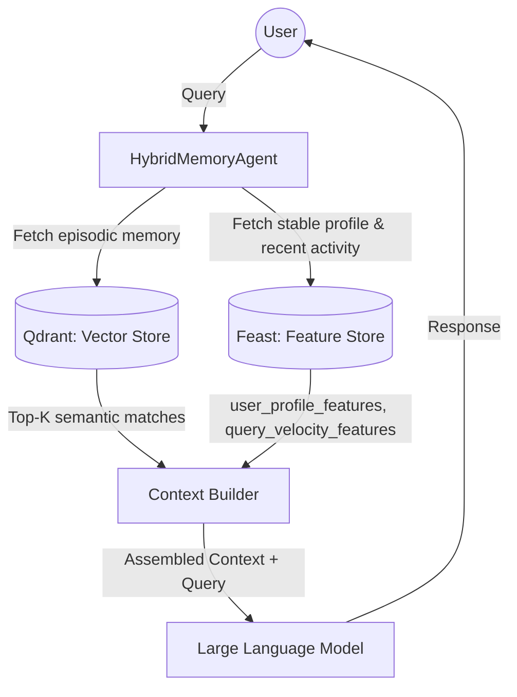

# Bonus Challenge: Hybrid Memory Agent Architecture

**Author:** Hung Cucu

## 1. Architecture Diagram

## 2. Architecture Decisions with Tradeoffs

### Decision 1: Chunking Strategy for Episodic Memory
**Decision:** We chunk episodic memory based on **Per-message (Conversation Turns)**.
**Tradeoff:** 
- *Why Per-message:* It provides discrete, semantically whole units of thought, making vector retrieval more accurate for specific facts without blending unrelated concepts.
- *Tradeoff vs Fixed Token:* Fixed token chunking is computationally cheaper and avoids large message edge-cases, but it often breaks semantic boundaries (e.g., cutting a sentence in half), leading to poor retrieval context. Per-message optimizes for retrieval quality over simple storage logic.

### Decision 2: Feature Schema Pattern (Tabular vs Embedding)
**Decision:** We store user preferences (e.g., `topic_affinity`, `reading_speed_wpm`) as **Tabular Features** in the Feature Store.
**Tradeoff:**
- *Why Tabular:* Tabular features are explicitly interpretable by both rules and the LLM (e.g., "User prefers 'cloud'"). They are easy to update via batch processes and extremely fast to retrieve (sub-millisecond).
- *Tradeoff vs Embedding Features:* Storing user history as an averaged embedding vector could capture latent, nuanced preferences, but it is uninterpretable, hard to debug, and prone to "concept drift" where older interactions unhelpfully dilute newer ones.

### Decision 3: Freshness Strategy
**Decision:** We use a **Streaming (Sub-second)** refresh strategy for `queries_last_hour` and a **Daily Batch** strategy for `topic_affinity`.
**Tradeoff:**
- *Why Streaming for velocity:* If a user suddenly asks 10 questions about "Kubernetes", the agent needs to know *immediately* to adjust its context (e.g., preventing repetitive fatigue or shifting focus). Batch updates would miss this critical window.
- *Tradeoff vs Batch:* Streaming requires higher infrastructure complexity (e.g., Kafka) and costs more compute. However, daily batch is perfectly fine for `topic_affinity` because broad interests don't shift minute-to-minute, saving compute where streaming isn't necessary.

## 3. Rejected Alternative
**Alternative:** I considered storing all episodic memories as an Embedding Feature View directly inside the Feast Feature Store.
**Reason for Rejection:** I explicitly rejected this because the re-index cycles and query patterns differ fundamentally. Feature Stores excel at O(1) primary-key lookups for specific entities, but are not optimized for high-dimensional similarity searches (ANN). Separating episodic memory into a Vector Store (Qdrant) handles ANN efficiently, while Feast handles the stable, key-value lookup profile.

## 4. Vietnamese-Context Considerations
**Decision:** NLP Tokenizer Choice.
When processing Vietnamese text for BM25 (Hybrid Search) or chunking, simple whitespace splitting is insufficient because Vietnamese words are often composed of multiple syllables separated by spaces (e.g., "điện toán đám mây"). 
To improve both BM25 precision and chunking boundaries, we should integrate a specialized tokenizer like **PyVi** or **underthesea**. This prevents the system from incorrectly matching "đám" and "mây" separately, vastly improving the accuracy of retrievals in a Vietnamese context.

## 5. Limitations
**What this POC doesn't handle yet:**
- **Privacy Isolation:** The current Qdrant setup stores all memories in one collection without strict payload filtering or tenant isolation. In production, we'd need per-user multi-tenancy or filtered indices to prevent cross-user data leakage.
- **Memory Decay:** There is no TTL on episodic memories, meaning the vector store will grow indefinitely and older, potentially irrelevant memories might surface and cloud the context.
